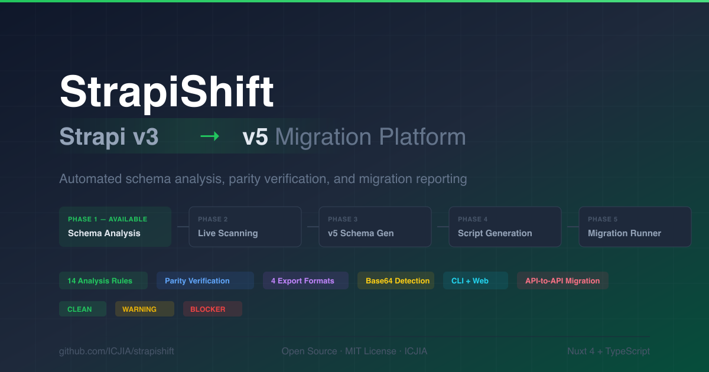

# StrapiShift

<p align="center">
  
</p>

<p align="center">
  <strong>Strapi v3 → v5 Migration Platform</strong><br>
  Automated schema analysis, parity verification, and migration reporting
</p>

<p align="center">
  <a href="LICENSE">MIT License</a> &middot;
  <a href="CHANGELOG.md">Changelog</a> &middot;
  <a href="docs/">Documentation</a>
</p>

---

## Quick Start

```bash
# Clone and install
git clone https://github.com/ICJIA/strapishift.git
cd strapishift
pnpm install

# Start everything (builds core + CLI, launches web at http://localhost:3000)
pnpm dev

# Or use the CLI directly
node packages/cli/dist/index.js analyze path/to/schema.json

# Run tests
pnpm test
```

---

## Why StrapiShift?

Migrating from Strapi v3 to v5 is a significant undertaking with no automated tooling. Developers must manually navigate breaking changes across:

- **Base64 images in rich text** — v3 commonly stored images as Base64 data URIs directly in rich text fields. This undocumented pattern silently breaks during migration.
- **MongoDB → SQL paradigm shift** — nested documents, arrays, and polymorphic references must be restructured.
- **API response format changes** — the `data.attributes` envelope, populate behavior, filter syntax, and pagination format all changed.
- **Relation storage changes** — cardinality syntax, junction tables, and population behavior are completely different.
- **Plugin ecosystem gaps** — many v3 plugins have no v5 equivalent.

StrapiShift automates this entire audit, encoding hard-won domain knowledge from real migrations into a rule engine that identifies every breaking change and produces actionable reports.

---

## How It Works

### 1. Get Your Schema

**From files** — copy your v3 `.settings.json` files from `api/[type]/models/`

**From a running instance** — StrapiShift connects directly to your Strapi admin panel and pulls all content-type schemas automatically (no CORS issues — uses a server-side proxy)

### 2. Analyze

The rule engine runs 14 rules across 7 categories against every content type and produces a structured migration report with:
- Traffic-light severity (clean / warning / blocker)
- Per-field remediation actions with effort estimates
- Migration readiness score
- Phased checklist

### 3. Export & Act

Download your report in four formats:
- **JSON** — feed to an LLM for automated code generation
- **HTML** — interactive dashboard with print stylesheet for handing to a contractor
- **Markdown** — commit as a migration audit trail
- **CSV** — sort, filter, assign in Excel/Sheets

---

## Features

### Core Product (v0.1.0)

| Feature | Description |
|---------|-------------|
| **Schema Analysis** | 14 rules across 7 categories detect every breaking change |
| **Parity Verification** | Compare v3 source against v5 target field-by-field |
| **Fetch from Instance** | Connect to a running Strapi instance to pull schemas automatically |
| **Four Export Formats** | JSON, HTML (with print stylesheet), Markdown, CSV |
| **CLI + Web** | Terminal interface and Nuxt 4 web dashboard |
| **Module Architecture** | Extensible — future phases plug in without modifying core |

### Rule Engine

| Category | Rules | What It Detects |
|----------|-------|----------------|
| **Database** | 3 | Field naming, MongoDB nested documents, ObjectId references |
| **API** | 4 | Response envelope, filter/sort/pagination, populate behavior |
| **Media** | 2 | Base64 candidates in rich text, media reference format |
| **Relations** | 3 | Cardinality syntax, polymorphic patterns, circular references |
| **Auth** | 1 | Users & Permissions plugin changes |
| **Plugins** | 1 | Plugin compatibility gaps |
| **GraphQL** | 1 | Schema regeneration requirements |

### Optional Modules (post-v1.0)

| Module | Phase | Description |
|--------|-------|-------------|
| `@strapishift/scanner` | 2 | Live instance scanning, Base64 detection |
| `@strapishift/generator` | 3 | Automated v5 schema generation |
| `@strapishift/migrator` | 4–5 | API-to-API migration scripts + runner |

---

## Architecture

```
strapishift/
├── packages/
│   ├── core/           @strapishift/core      Analysis engine + rule system
│   ├── web/            @strapishift/web       Nuxt 4.4.2 + Nuxt UI 4.5.1
│   └── cli/            @strapishift/cli       Terminal interface (citty)
├── docs/                                      13-document design suite
├── scripts/                                   Version bump utilities
├── netlify.toml                               Deployment config
├── CHANGELOG.md                               Release history
├── LICENSE                                    MIT
└── package.json
```

### Tech Stack

| Component | Technology |
|-----------|-----------|
| Frontend | Nuxt 4.4.2 + Nuxt UI 4.5.1 |
| CLI | citty (UnJS) |
| Package Manager | pnpm (monorepo workspaces) |
| Language | TypeScript (strict mode) |
| Testing | Vitest |
| Deploy | Netlify (SSR + serverless functions) |
| Accessibility | WCAG 2.1 AA |

---

## Testing

62 tests across 6 test files covering the core analysis engine and CLI.

```bash
pnpm test          # run all tests
pnpm test:core     # core package only (53 tests)
```

### Test coverage

| Package | Tests | What's tested |
|---------|-------|---------------|
| `@strapishift/core` | 53 | Schema parser (13), rule engine (14), reporters (10), parity checker (10), module registry (6) |
| `@strapishift/cli` | 9 | Analyze command, terminal reporter, file writer |

### Test fixtures

Test fixtures are real-world Strapi v3 schemas at `packages/core/test/fixtures/`:
- `v3-article-schema.json` — single content type with relations, media, components, dynamic zones (MongoDB)
- `v3-multi-schema.json` — three content types with circular relations

---

## Deployment on Netlify

StrapiShift is designed to deploy on Netlify with zero configuration beyond connecting the repo. The included `netlify.toml` handles the entire build pipeline.

### Step-by-step

1. **Push to GitHub** — ensure all code is committed and pushed to `https://github.com/ICJIA/strapishift`

2. **Connect to Netlify**
   - Log into [app.netlify.com](https://app.netlify.com)
   - Click **"Add new site" → "Import an existing project"**
   - Select the **ICJIA/strapishift** repo from GitHub

3. **Netlify auto-detects `netlify.toml`** — no manual build settings needed:
   ```
   Base directory:    packages/web
   Build command:     cd ../.. && pnpm install && pnpm build:core && cd packages/web && npx nuxt build
   Publish directory: dist
   Node version:      20
   ```

4. **Click Deploy** — Netlify will:
   - Install pnpm and all workspace dependencies
   - Build `@strapishift/core` (the analysis engine)
   - Build the Nuxt 4 web app with the `netlify` preset
   - Deploy the static pages + serverless function for schema fetching

5. **(Optional) Custom domain** — add `strapishift.com` or your domain in Netlify's domain settings. HTTPS is automatic via Let's Encrypt.

### What gets deployed

| Component | Netlify Layer | Purpose |
|-----------|--------------|---------|
| Pages (`/`, `/analyze`, `/report`, `/verify`, `/changelog`, `/about`) | Static HTML + JS | Client-side app — all analysis runs in the browser |
| `/api/fetch-schema` | Serverless Function | Server-side proxy for fetching Strapi schemas (avoids CORS) |

### Environment

No environment variables are required. The app is fully self-contained — analysis runs client-side, and the serverless proxy uses only the credentials the user provides per-request (nothing is stored).

### Local preview

```bash
pnpm build                             # builds core → CLI → web
npx serve packages/web/dist            # preview the static site locally
```

The serverless function (`/api/fetch-schema`) only works on Netlify or in dev mode (`pnpm dev`). Local preview serves static files only — "Fetch from Instance" falls back to direct client-side fetch (requires CORS on the Strapi instance).

### Serverless proxy security

The `/api/fetch-schema` endpoint is hardened against abuse:

- **Not an open proxy** — only hits two fixed Strapi endpoints: `/admin/login` and `/content-type-builder/content-types`
- **SSRF protection** — blocks private IPs (RFC 1918), IPv6 mapped addresses, octal/hex/decimal IP encoding, cloud metadata endpoints
- **Localhost blocked in production** — prevents SSRF to container-local services
- **1-second artificial delay** per request — brute-force resistant on serverless (no in-memory state needed)
- **10-second timeout** per outbound request
- **5MB response limit** — prevents memory exhaustion
- **Uniform error messages** — prevents credential oracle attacks
- **Prototype pollution protection** — strips dangerous keys from schema responses
- **No credentials logged or stored**

---

## Scripts

| Command | Description |
|---------|-------------|
| `pnpm dev` | Build core + CLI, start web dev server at http://localhost:3000 |
| `pnpm dev:web` | Start web dev server only (skip rebuilds) |
| `pnpm build` | Build everything (core → CLI → web) |
| `pnpm test` | Run all 62 tests |
| `pnpm clean` | Clear all build artifacts |
| `pnpm version:bump patch` | Bump version 0.1.0 → 0.1.1 across all packages |
| `pnpm version:bump minor` | Bump version 0.1.0 → 0.2.0 across all packages |
| `pnpm version:bump major` | Bump version 0.1.0 → 1.0.0 across all packages |

---

## Documentation

The `/docs` directory contains a 13-document design suite:

| Doc | Title |
|-----|-------|
| 00 | Master Design Document |
| 01 | Phase 1: Schema Analysis & Parity Verification |
| 02 | Phase 2: Live Instance Scanning |
| 03 | Phase 3: v5 Schema Generation |
| 04 | Phase 4: Migration Script Generation |
| 05 | Phase 5: Migration Runner |
| 06 | Security |
| 07 | LLM Build Prompts (all 5 phases) |
| 08 | Differentiation & Competitive Analysis |
| 09 | Monorepo & Website |
| 10 | Revision & Gap Analysis |
| 11 | Architecture Decision Records (9 ADRs) |
| 12 | Use Cases & Personas |

---

## Changelog

See [CHANGELOG.md](CHANGELOG.md) for the full release history.

The changelog is also viewable in the web UI at `/changelog`.

---

## Origin

Built from real-world migration experience at the [Illinois Criminal Justice Information Authority (ICJIA)](https://icjia.illinois.gov). StrapiShift encodes knowledge from the ResearchHub Strapi v3 → v5 migration — a 50-item checklist of breaking changes, gotchas, and undocumented issues, automated into a rule engine.

---

## License

[MIT](LICENSE) — Copyright 2026 Illinois Criminal Justice Information Authority

## Author

Chris Schweda — [ICJIA](https://github.com/ICJIA)
